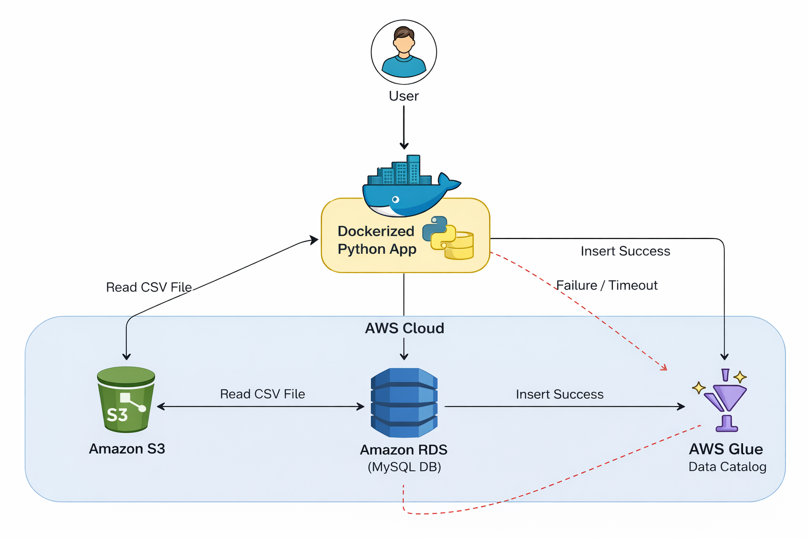
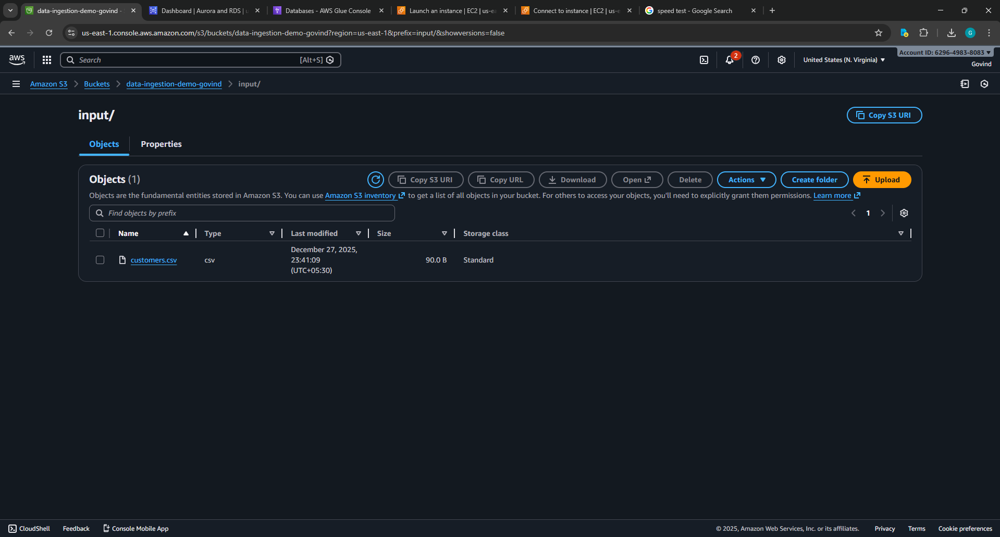
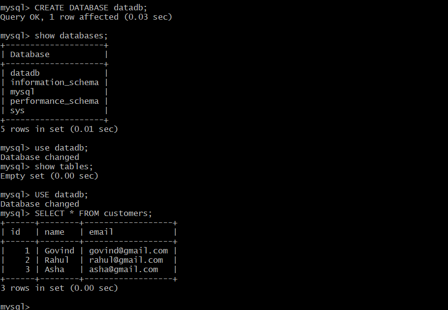
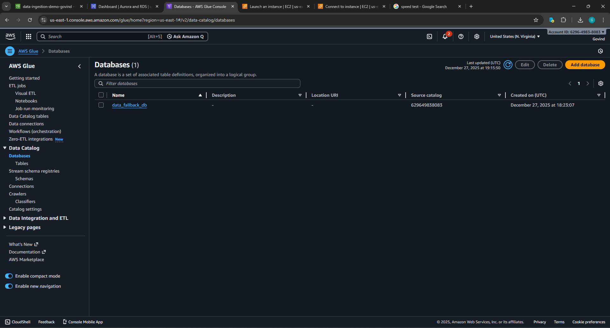
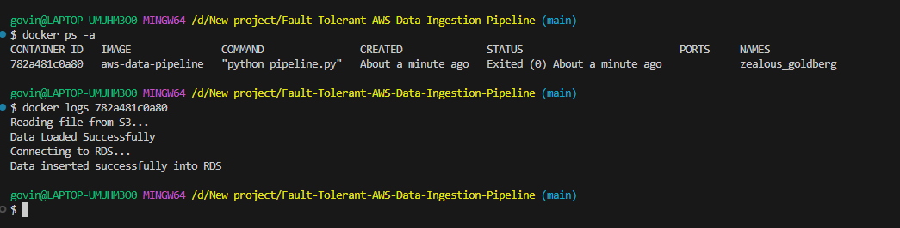

# Fault-Tolerant AWS Data Ingestion Pipeline

S3 → RDS (MySQL) with Automatic AWS Glue Fallback
Dockerized Python Application

---

## Overview

This project implements a resilient cloud data ingestion pipeline using AWS services and Docker. The application reads a CSV file from Amazon S3 and attempts to load it into an Amazon RDS MySQL database. If the RDS connection fails or insertion is unsuccessful, the system automatically falls back to AWS Glue and registers the dataset into the Glue Data Catalog.

This project demonstrates real-world cloud integration, fault tolerance, and production-style data engineering.

---

## Architecture Diagram

### Architecture Screenshot



---

## AWS Services Used

* Amazon S3 – Source dataset storage
* Amazon RDS (MySQL) – Primary relational database
* AWS Glue Data Catalog – Fallback metadata registry
* IAM – Secure access
* Docker – Runtime and deployment packaging

---

## Project Structure

```
aws-data-pipeline/
│
├── pipeline.py
├── Dockerfile
├── requirements.txt
└── README.md
```

---

## Prerequisites

* AWS Account
* Docker installed and running
* AWS credentials configured
* RDS MySQL instance publicly accessible
* Database created in RDS (example: datadb)
* AWS Glue database created (example: data_fallback_db)
* CSV file uploaded to S3

---

## Configuration Variables

| Variable         | Description       |
| ---------------- | ----------------- |
| S3_BUCKET        | S3 bucket name    |
| S3_KEY           | CSV file path     |
| RDS_HOST         | RDS endpoint      |
| RDS_USER         | Database username |
| RDS_PASS         | Database password |
| RDS_DB           | Database name     |
| RDS_TABLE        | Target table      |
| GLUE_DB          | Glue database     |
| GLUE_TABLE       | Glue table        |
| GLUE_S3_LOCATION | S3 dataset path   |

---

## Running the Application

### Build Docker Image

```
docker build -t aws-data-pipeline .
```

### Run Container

```
docker run --rm ^
-e AWS_ACCESS_KEY_ID=YOUR_KEY ^
-e AWS_SECRET_ACCESS_KEY=YOUR_SECRET ^
-e AWS_DEFAULT_REGION=us-east-1 ^
-e S3_BUCKET=your-bucket ^
-e S3_KEY=input/customers.csv ^
-e RDS_HOST=xxxx.rds.amazonaws.com ^
-e RDS_USER=admin ^
-e RDS_PASS=xxxxx ^
-e RDS_DB=datadb ^
-e RDS_TABLE=customers ^
-e GLUE_DB=data_fallback_db ^
-e GLUE_TABLE=customers_fallback ^
-e GLUE_S3_LOCATION=s3://your-bucket/input/ ^
aws-data-pipeline
```

---

## Expected Output

### Successful RDS Load

```
Reading file from S3...
Data Loaded Successfully
Connecting to RDS...
Data inserted successfully into RDS
```

### RDS Failure Fallback

```
RDS Upload Failed
FALLBACK → Registering in AWS Glue
Table registered in Glue successfully
```

---

# Deliverables

### 1. GitHub Repository

* pipeline.py
* Dockerfile
* requirements.txt
* README.md

---

### 2. Working Docker Execution Proof

Provide logs showing:

* Successful push to RDS
  or
* Automatic fallback to Glue

---

### 3. Required Screenshots

#### Architecture Diagram


#### S3 Bucket Screenshot



#### RDS MySQL Records Screenshot (if success case)



#### AWS Glue Table Screenshot (if fallback case)



#### Docker Execution Logs



---

## Challenges Faced and Solutions

* RDS access failures fixed by enabling public access and opening port 3306
* Unknown database errors solved by creating database manually
* Glue failures fixed by creating Glue database in correct region
* Docker connectivity issues resolved by starting Docker Desktop and WSL

---

## Status

Project successfully implemented, tested, and verified.

