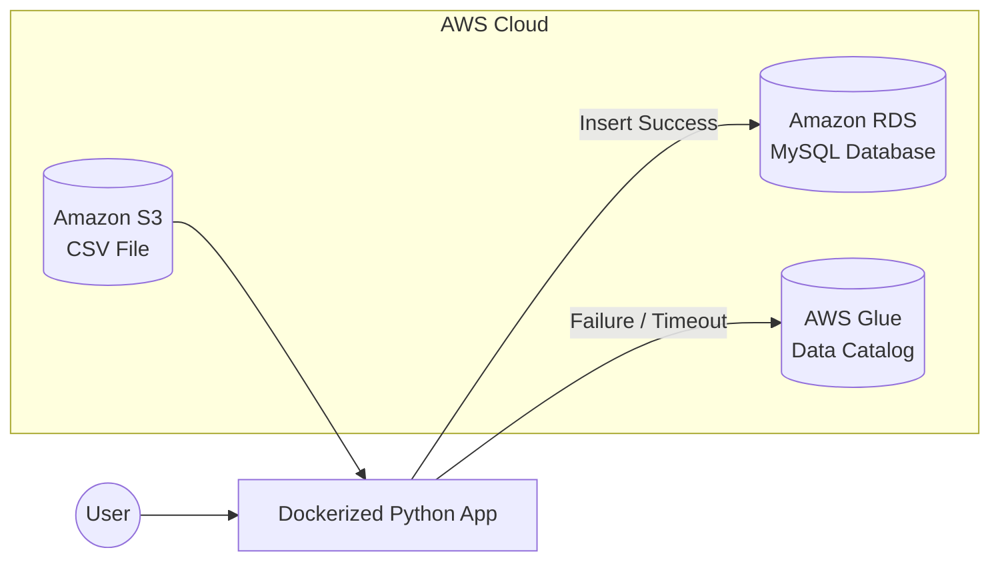

Great, here is your **updated READY-TO-COPY README.md** with additional screenshot sections clearly defined.
You can paste this directly into GitHub. Only requirement: place screenshots in the `/screenshots` folder.

---

# Fault-Tolerant AWS Data Ingestion Pipeline

S3 → RDS (MySQL) with Automatic AWS Glue Fallback
Dockerized Python Application

---

## Overview

This project implements a resilient cloud data ingestion pipeline using AWS services and Docker. The application reads a CSV file from Amazon S3 and attempts to load it into an Amazon RDS MySQL database. If the RDS connection fails or insertion is unsuccessful, the system automatically falls back to AWS Glue and registers the dataset into the Glue Data Catalog.

This project demonstrates real-world cloud integration, fault tolerance, and production-style data engineering.

---

## Architecture Diagram

### Architecture Screenshot

Place your diagram image in the repository:

```
/screenshots/architecture-diagram.png
```

Then it will display here:


---

### Architecture Flow (GitHub Rendered Diagram)



---

## AWS Services Used

* Amazon S3 – Source dataset storage
* Amazon RDS (MySQL) – Primary relational database
* AWS Glue Data Catalog – Fallback metadata registry
* IAM – Secure access
* Docker – Runtime and deployment packaging

---

## Project Structure

```
aws-data-pipeline/
│
├── pipeline.py
├── Dockerfile
├── requirements.txt
└── README.md
```

---

## Prerequisites

* AWS Account
* Docker installed and running
* AWS credentials configured
* RDS MySQL instance publicly accessible
* Database created in RDS (example: datadb)
* AWS Glue database created (example: data_fallback_db)
* CSV file uploaded to S3

---

## Configuration Variables

| Variable         | Description       |
| ---------------- | ----------------- |
| S3_BUCKET        | S3 bucket name    |
| S3_KEY           | CSV file path     |
| RDS_HOST         | RDS endpoint      |
| RDS_USER         | Database username |
| RDS_PASS         | Database password |
| RDS_DB           | Database name     |
| RDS_TABLE        | Target table      |
| GLUE_DB          | Glue database     |
| GLUE_TABLE       | Glue table        |
| GLUE_S3_LOCATION | S3 dataset path   |

---

## Running the Application

### Build Docker Image

```
docker build -t aws-data-pipeline .
```

### Run Container

```
docker run --rm ^
-e AWS_ACCESS_KEY_ID=YOUR_KEY ^
-e AWS_SECRET_ACCESS_KEY=YOUR_SECRET ^
-e AWS_DEFAULT_REGION=us-east-1 ^
-e S3_BUCKET=your-bucket ^
-e S3_KEY=input/customers.csv ^
-e RDS_HOST=xxxx.rds.amazonaws.com ^
-e RDS_USER=admin ^
-e RDS_PASS=xxxxx ^
-e RDS_DB=datadb ^
-e RDS_TABLE=customers ^
-e GLUE_DB=data_fallback_db ^
-e GLUE_TABLE=customers_fallback ^
-e GLUE_S3_LOCATION=s3://your-bucket/input/ ^
aws-data-pipeline
```

---

## Expected Output

### Successful RDS Load

```
Reading file from S3...
Data Loaded Successfully
Connecting to RDS...
Data inserted successfully into RDS
```

### RDS Failure Fallback

```
RDS Upload Failed
FALLBACK → Registering in AWS Glue
Table registered in Glue successfully
```

---

# Deliverables

### 1. GitHub Repository

* pipeline.py
* Dockerfile
* requirements.txt
* README.md

---

### 2. Working Docker Execution Proof

Provide execution logs that show:

* Successful push to RDS
  or
* Automatic fallback to Glue

---

### 3. Required Screenshots

Create a folder:

```
/screenshots
```

Add the following screenshots:

#### 1. Architecture Diagram

File:

```
screenshots/architecture-diagram.png
```

#### 2. S3 Bucket Screenshot

Showing CSV file inside bucket.

```
screenshots/s3-bucket.png
```

#### 3. RDS MySQL Records Screenshot (if success case)

Show inserted records from RDS Query Editor.

```
screenshots/rds-records.png
```

#### 4. AWS Glue Table Screenshot (if fallback case)

Show created Glue table in Glue Catalog.

```
screenshots/glue-table.png
```

#### 5. Docker Execution Logs

Screenshot of successful run.

```
screenshots/docker-logs.png
```


## Challenges Faced and Solutions

* RDS access failures fixed by enabling public access and opening port 3306.
* Unknown database errors solved by creating database manually.
* Glue failures fixed by creating Glue database in correct region.
* Docker connectivity issues resolved by starting Docker Desktop and WSL.

---

